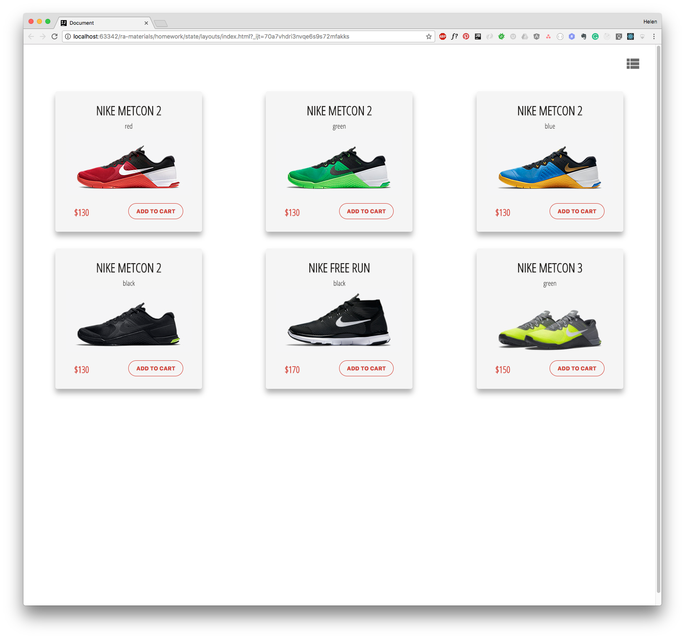

# Расположение товаров на маркетплейсе

Необоходимо сделать приложение для отображения товаров в интернет-магазине. Заказчик хочет, чтобы пользователь мог увидеть товары в виде карточек или в виде списка, в зависимости от того, какое расположение он выберет.

## Макеты от заказчика:

## Технологии
- React (Vite)
- JavaScript (ES6+)
- CSS Grid и Flexbox
- Material Icons (Google Fonts)
- GitHub Actions (CI/CD)